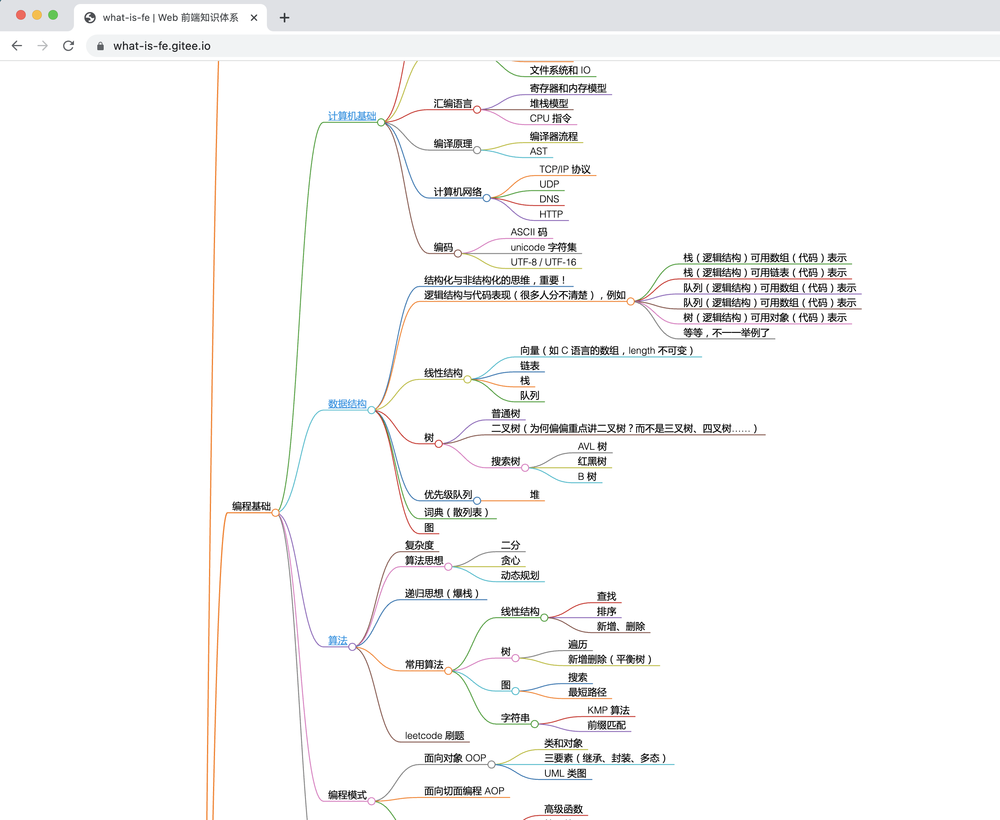

# 前端知识体系

## 什么是知识体系

完善的知识范围，包含了前端工程师常用的所有知识点
合理的结构化，便于理解和记忆

## 主要模块

- 计算机基础，如算法、数据结构、设计模式等
- 前端基础知识，如 HTML JS 语法和 API 等
- 网络，如 HTTP 协议
- 开发流程，如打包构建、CI/CD
- 前端框架，常见的 Vue React 及其周边工具
- 运行和监控，如安全、性能优化

## 详细内容

