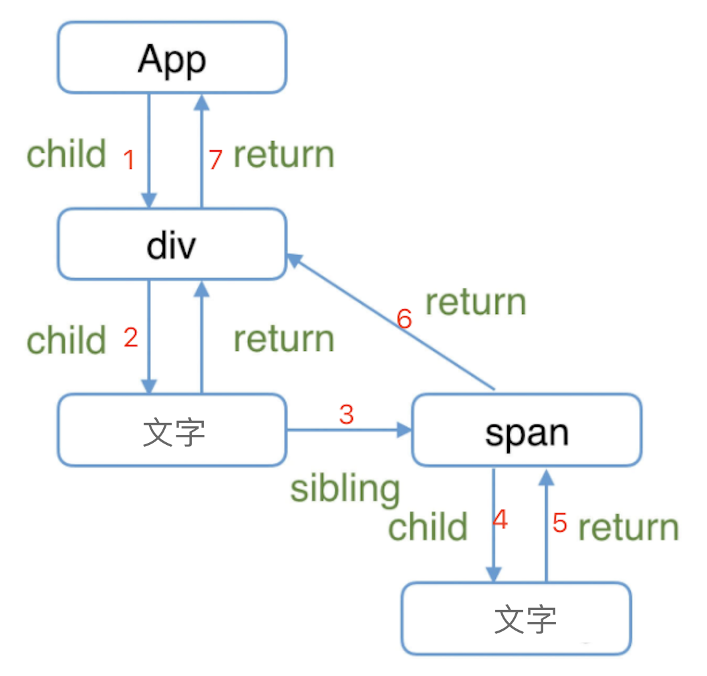

# 反转单向链表

## 题目

定义一个函数，输入一个单向链表的头节点，反转该链表，并输出反转之后的头节点

## 链表

链表是一种物理结构（非逻辑结构），是数组的补充。<br>
数组需要一段连续的内存空间，而链表不需要。

数据结构
- 单向链表 `{ value, next }`
- 双向链表 `{ value, prev, next }`

两者对比
- 链表：查询慢，新增和删除较快
- 数组：查询快，新增和删除较慢

## 应用场景

React Fiber 就把 vdom 树转换为一个链表，这样才有可能随时中断、再继续进行。<br>
如果 vdom 是树，那只能递归一次性执行完成，中间无法断开。



## 分析

反转链表，画图很好理解。没有捷径，遍历一边，重新设置 next 指向即可。<br>
但实际写代码，却并不简单，很容易造成 nextNode 丢失。

因此，遍历过程中，至少要存储 3 个指针 `prevNode` `curNode` `nextNode`

时间复杂度 `O(n)`

## 答案

参考 reverse-link-list.ts

```ts
export interface ILinkListNode {
    value: number
    next?: ILinkListNode
}

/**
 * 反转单向链表，并返回反转之后的 head node
 * @param listNode list head node
 */
export function reverseLinkList(listNode: ILinkListNode): ILinkListNode {
    // 定义三个指针
    let prevNode: ILinkListNode | undefined = undefined
    let curNode: ILinkListNode | undefined = undefined
    let nextNode: ILinkListNode | undefined = listNode

    // 以 nextNode 为主，遍历链表
    while(nextNode) {
        // 第一个元素，删掉 next ，防止循环引用
        if (curNode && !prevNode) {
            delete curNode.next
        }

        // 反转指针
        if (curNode && prevNode) {
            curNode.next = prevNode
        }

        // 整体向后移动指针
        prevNode = curNode
        curNode = nextNode
        nextNode = nextNode?.next
    }

    // 最后一个的补充：当 nextNode 空时，此时 curNode 尚未设置 next
    curNode!.next = prevNode

    return curNode!
}

/**
 * 根据数组创建单向链表
 * @param arr number arr
 */
export function createLinkList(arr: number[]): ILinkListNode {
    const length = arr.length
    if (length === 0) throw new Error('arr is empty')

    let curNode: ILinkListNode = {
        value: arr[length - 1]
    }
    if (length === 1) return curNode

    for (let i = length - 2; i >= 0; i--) {
        curNode = {
            value: arr[i],
            next: curNode
        }
    }

    return curNode
}

const arr = [100, 200, 300, 400, 500]
const list = createLinkList(arr)
console.info('list:', list)

const list1 = reverseLinkList(list)
console.info('list1:', list1)

```


## 划重点

- 链表
- 链表和数组的不同
    - 内存占用
    - 查询、新增、删除的效率
- 如何保证 nextNode 不丢失

## 扩展

思考：用数组和链表实现队列，哪个性能更好？

