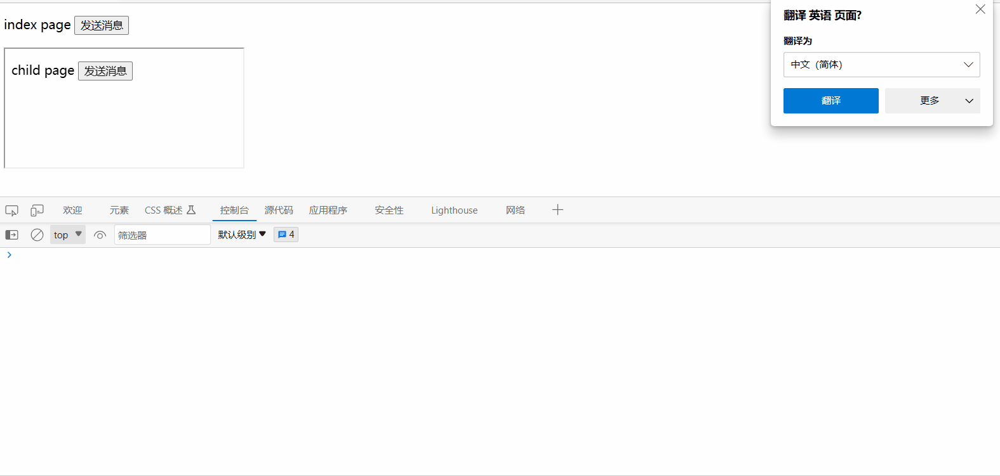

# 网页多标签页之间的通讯

## 题目

网络多标签之间如何通讯？<br>
例如打开两个 chrome 标签，一个访问列表页，一个访问详情页。在详情页修改了标题，列表页也要同步过来。

## webSocket

通过 webSocket 多页面通讯，无跨域限制。

## localStorage

同域的两个页面，可以通过 localStorage 通讯。A 页面可以监听到 B 页面的数据变化。

```js
// list 页面
window.addEventListener('storage', event => {
    console.log('key', event.key)
    console.log('newValue', event.newValue)
})

// detail 页面
localStorage.setItem('changeInfo', 'xxx')
```

## SharedWorker

Javascript 是单线程的，而且和页面渲染线程互斥。所以，一些计算量大的操作会影响页面渲染。<br>

[WebWorker](https://developer.mozilla.org/zh-CN/docs/Web/API/Web_Workers_API/Using_web_workers) 可以 `new Worker('xxx.js')` 用来进行 JS 计算，并通过 `postMessage` 和 `onmessage` 和网页通讯。<br>
但这个 worker 是当前页面专有的，不得多个页面、iframe 共享。

PS：WebWorker 专用于 JS 计算，不支持 DOM 操作。

[SharedWorker](https://developer.mozilla.org/zh-CN/docs/Web/API/SharedWorker) 可以被同域的多个页面共享使用，也可以用于通讯。<br>
源码参考 msg-sharedWork-list.html 和 msg-sharedWork-detail.html 。注意，worker 中的日志需要 `chrome://inspect` 中打开控制台查看。

PS：注意浏览器兼容性，不支持 IE11

## 答案

- webSocket 需要服务端参与，但不限制跨域
- localStorage 简单易用
- SharedWorker 本地调试不太方便，考虑浏览器兼容性

## 连环问：iframe 通讯

除了上述几个方法，iframe 通讯最常用 [window.postMessage](https://developer.mozilla.org/zh-CN/docs/Web/API/Window/postMessage) ，支持跨域。

通过 `window.postMessage` 发送消息。注意第二个参数，可以限制域名，如发送敏感信息，要限制域名。

```js
// 父页面向 iframe 发送消息
window.iframe1.contentWindow.postMessage('hello', '*')

// iframe 向父页面发送消息
window.parent.postMessage('world', '*')
```

可监听 `message` 来接收消息。可使用 `event.origin` 来判断信息来源是否合法，可选择不接受。

```js
window.addEventListener('message', event => {
    console.log('origin', event.origin) // 通过 origin 判断是否来源合法
    console.log('child received', event.data)
})
```

index.html
```html
<!DOCTYPE html>
<html lang="en">
<head>
    <meta charset="UTF-8">
    <meta http-equiv="X-UA-Compatible" content="IE=edge">
    <meta name="viewport" content="width=device-width, initial-scale=1.0">
    <title>index</title>
</head>
<body>
    <p>
        index page
        <button id="btn1">发送消息</button>
    </p>

    <iframe id="iframe1" src="./child.html"></iframe>

    <script>
        const btn1 = document.getElementById('btn1')
        btn1.addEventListener('click', () => {
            console.info('index clicked')
            window.iframe1.contentWindow.postMessage('hello', '*')
        })

        window.addEventListener('message', event => {
            console.info('origin', event.origin) // 来源的域名
            console.info('index received', event.data)
        })
    </script>
</body>
</html>
```


child.html
```html
<!DOCTYPE html>
<html lang="en">
<head>
    <meta charset="UTF-8">
    <meta http-equiv="X-UA-Compatible" content="IE=edge">
    <meta name="viewport" content="width=device-width, initial-scale=1.0">
    <title>child</title>
</head>
<body>
    <p>
        child page
        <button id="btn1">发送消息</button>
    </p>

    <script>
        const btn1 = document.getElementById('btn1')
        btn1.addEventListener('click', () => {
            console.info('child clicked')
            window.parent.postMessage('world', '*')
        })

        window.addEventListener('message', event => {
            console.info('origin', event.origin) // 判断 origin 的合法性
            console.info('child received', event.data)
        })
    </script>
</body>
</html>
```

