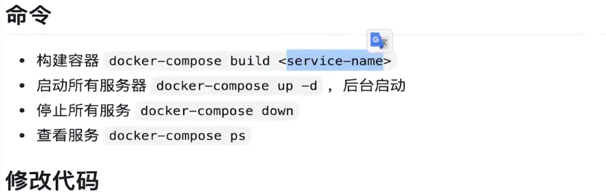

# Docker-compose教程
## 定义
>  Compose 项目是 Docker 官方的开源项目，负责实现对 Docker 容器集群的快速编排。使用前面介绍的     Dockerfile我们很容易定义一个单独的应用容器。然而在日常开发工作中，经常会碰到需要多个容器相互配合来完成某项任务的情况。例如要实现一个 Web 项目，除了 Web 服务容器本身，往往还需要再加上后端的数据库服务容器；再比如在分布式应用一般包含若干个服务，每个服务一般都会部署多个实例。如果每个服务都要手动启停，那么效率之低、维护量之大可想而知。这时候就需要一个工具能够管理一组相关联的的应用容器，这就是Docker Compose。

## 安装

 1.  https://docs.docker.com/desktop/install/windows-install/
 2.  添加可执行权限 (LINUX)
 3.  测试安装
```
docker-compose --version
```



1. 构建容器
  docker-compose build  editor-server
2. 启动所有服务
   docker-compose   up  -d 
3. 停止所有服务
   docker-compose down
4. 查看服务
   docker-compose ps
