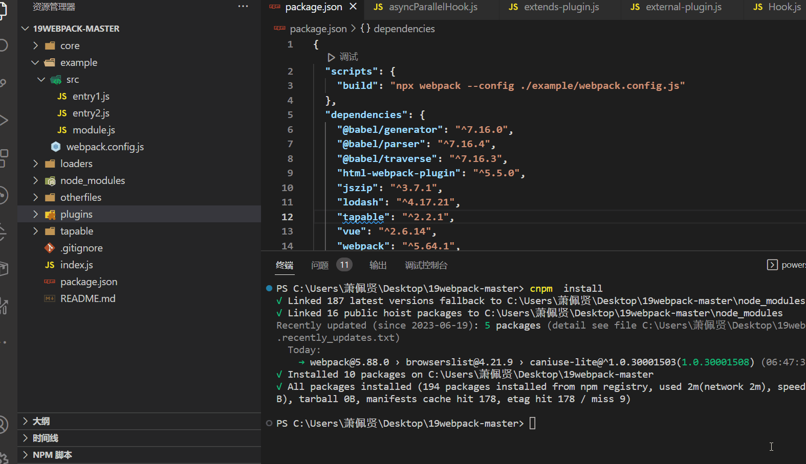

# 手写一个webpack插件

## CompressAssetsPlugin 
> 每次打包结束后将本次打包生成出的所有资源打包成为一个 zip 包


### 原理分析
围绕 Webpack 打包过程中存在两个核心对象：
- compiler
compiler 在 Webpack 启动打包时创建，保存着本次打包的所有初始化配置信息。

在每一次进行打包过程中它会创建 compilation 对象进行模块打包。关于如何理解每一次比方说我们在 watch (devServer) 模式中，每当文件内容发生变化时都会产生一个 compilation 对象进行打包，而 compiler 对象永远只有一个，除非你终止打包命令重新调用 webpack 。
- compilation
compilation 代表这一次资源构建的过程，在 compilation 对象中我们可以通过一系列 API 访问/修改本次打包生成的 module、assets 以及 chunks 。

官网在这个链接介绍了这两个对象。

这里我们需要在每一次打包即将生成后将输出的资源文件统一打包进入 zip ，主要用到以下内容：

- [JS Zip](https://stuk.github.io/jszip/)
这是一个 JS 生成 zip 压缩包的库，我们会使用这个库来生成 Zip 内容。

- [compiler Emit Hook](https://webpack.js.org/api/compiler-hooks/#emit)
compiler 对象上的 Emit Hook 会在输出 asset 到 output 目录之前执行，简单来说就是每次即将打包完成生成文件时会调用该钩子。

- [compilation 对象方法](https://webpack.js.org/api/compilation-object/)
在打包过程中我们需要获取本次打包即将生成的资源，可以使用 compilation.getAssets() 方法首先获得原始打包生成的资源文件内容以及通过 compilation.emitAssets() 输出生成的 zip 到打包结果中去。

### 动手实现
上边我们介绍了基本的基本原理，接下里就让我们一起来动手实现这个插件。

首先任何一个 Webpack Plugin 都是一个模块，这个模块导出了一个类或者说函数，该函数必须存在一个名为 apply 的原型方法。

在调用 webpack() 方法开始打包时，会将 compiler 对象传递给每一个插件的 apply 方法并且调用他们注册对应的 Hook 。

让我们先来实现一下基础内容，让我们在 ./plugins 目录下创建一个 CompressAssetsPlugin.js文件:
```js
const pluginName = 'CompressAssetsPlugin';
class CompressAssetsPlugin {
  // 在配置文件中传入的参数会保存在插件实例中
  constructor({ output }) {
    // 接受外部传入的 output 参数
    this.output = output;
  }
 
  apply(compiler) {
    // 注册函数 在webpack即将输出打包文件内容时执行
    compiler.hooks.emit.tapAsync(pluginName, (compilation,callback) => {
        // dosomething
    })
  }
}
 
module.exports = CompressAssetsPlugin;
```

上边我们简单搭建了插件的基础结构，我们在 apply 方法中通过 compiler.hooks.emit.tapAsync 注册了一个事件函数，这个事件函数会在每次即将打包完成生成文件时会调用该函数。

我们通过 tapAsync 注册的事件函数中接受两个参数:

第一个参数为 compilation 对象表示本次构建的相关对象

callback 参数对应我们通过 tapAsync 注册的异步事件函数，当调用 callback() 时表示注册事件执行完成。

上边我们已经在打包即将输出文件时注册了一个事件函数，之后让我们来为函数填充更加具体的业务逻辑--获得本次编译的资源利用 JSZip 生成压缩包输出到最终目录中。

```js
const JSZip = require('jszip');
const { RawSource } = require('webpack-sources');
/* 
  将本次打包的资源都打包成为一个压缩包
  需求:获取所有打包后的资源
*/
 
const pluginName = 'CompressAssetsPlugin';
 
class CompressAssetsPlugin {
  constructor({ output }) {
    this.output = output;
  }
 
  apply(compiler) {
    // AsyncSeriesHook 将 assets 输出到 output 目录之前调用该钩子
    compiler.hooks.emit.tapAsync(pluginName, (compilation, callback) => {
      // 创建zip对象
      const zip = new JSZip();
      // 获取本次打包生成所有的assets资源
      const assets = compilation.getAssets();
      // 循环每一个资源
      assets.forEach(({ name, source }) => {
        // 调用source()方法获得对应的源代码 这是一个源代码的字符串
        const sourceCode = source.source();
        // 往 zip 对象中添加资源名称和源代码内容
        zip.file(name, sourceCode);
      });
      // 调用 zip.generateAsync 生成 zip 压缩包
      zip.generateAsync({ type: 'nodebuffer' }).then((result) => {
        // 通过 new RawSource 创建压缩包
        // 并且同时通过 compilation.emitAsset 方法将生成的 Zip 压缩包输出到 this.output
        compilation.emitAsset(this.output, new RawSource(result));
        // 调用 callback 表示本次事件函数结束
        callback();
      });
    });
  }
}
 
module.exports = CompressAssetsPlugin;
```


## custom-webpack-plugins

> 复制插件

### 实现
```js
// plugins/custom-webpack-plugins
const fs = require('fs-extra')
const path = require('path')

class CustomWebpackPlugin {
  apply(compiler) {
    const outputPath = compiler.options.output.path
    const hooks = compiler.hooks

    // 清除 build 目录
    hooks.emit.tap('custom-webpack-plugin', (compilation) => {
      fs.removeSync(outputPath)
    })

    // copy 静态资源
    const otherFilesPath = path.resolve(__dirname, '../otherfiles')
    hooks.done.tap('custom-webpack-plugin', (compilation) => {
      fs.copySync(otherFilesPath, path.resolve(outputPath, 'otherfiles'))
    })
  }
}

module.exports = CustomWebpackPlugin

```


## 演示
