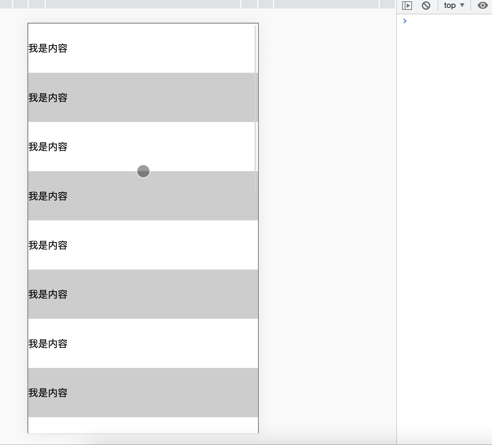

# 如何实现上拉加载，下拉刷新？

 

## 一、前言

下拉刷新和上拉加载这两种交互方式通常出现在移动端中

本质上等同于PC网页中的分页，只是交互形式不同

开源社区也有很多优秀的解决方案，如`iscroll`、`better-scroll`、`pulltorefresh.js`库等等

这些第三方库使用起来非常便捷

我们通过原生的方式实现一次上拉加载，下拉刷新，有助于对第三方库有更好的理解与使用

## 二、实现原理

上拉加载及下拉刷新都依赖于用户交互

最重要的是要理解在什么场景，什么时机下触发交互动作

### 上拉加载

首先可以看一张图


上拉加载的本质是页面触底，或者快要触底时的动作

判断页面触底我们需要先了解一下下面几个属性

- `scrollTop`：滚动视窗的高度距离`window`顶部的距离，它会随着往上滚动而不断增加，初始值是0，它是一个变化的值

- `clientHeight`:它是一个定值，表示屏幕可视区域的高度；
- `scrollHeight`：页面不能滚动时也是存在的,此时scrollHeight等于clientHeight。scrollHeight表示`body`所有元素的总长度(包括body元素自身的padding)

综上我们得出一个触底公式：
```js
scrollTop + clientHeight >= scrollHeight
```

简单实现
```js
let clientHeight  = document.documentElement.clientHeight; //浏览器高度
let scrollHeight = document.body.scrollHeight;
let scrollTop = document.documentElement.scrollTop;
 
let distance = 50;  //距离视窗还用50的时候，开始触发；

if ((scrollTop + clientHeight) >= (scrollHeight - distance)) {
    console.log("开始加载数据");
}
```


### 下拉刷新
下拉刷新的本质是页面本身置于顶部时，用户下拉时需要触发的动作

关于下拉刷新的原生实现，主要分成三步：

- 监听原生`touchstart`事件，记录其初始位置的值，`e.touches[0].pageY`；
- 监听原生`touchmove`事件，记录并计算当前滑动的位置值与初始位置值的差值，大于`0`表示向下拉动，并借助CSS3的`translateY`属性使元素跟随手势向下滑动对应的差值，同时也应设置一个允许滑动的最大值；
- 监听原生`touchend`事件，若此时元素滑动达到最大值，则触发`callback`，同时将`translateY`重设为`0`，元素回到初始位置

举个例子：

`Html`结构如下：

```js
<main>
    <p class="refreshText"></p >
    <ul id="refreshContainer">
        <li>111</li>
        <li>222</li>
        <li>333</li>
        <li>444</li>
        <li>555</li>
        ...
    </ul>
</main>
```

监听`touchstart`事件，记录初始的值

```js
var _element = document.getElementById('refreshContainer'),
    _refreshText = document.querySelector('.refreshText'),
    _startPos = 0,  // 初始的值
    _transitionHeight = 0; // 移动的距离

_element.addEventListener('touchstart', function(e) {
    _startPos = e.touches[0].pageY; // 记录初始位置
    _element.style.position = 'relative';
    _element.style.transition = 'transform 0s';
}, false);
```

监听`touchmove`移动事件，记录滑动差值

```js
_element.addEventListener('touchmove', function(e) {
    // e.touches[0].pageY 当前位置
    _transitionHeight = e.touches[0].pageY - _startPos; // 记录差值

    if (_transitionHeight > 0 && _transitionHeight < 60) { 
        _refreshText.innerText = '下拉刷新'; 
        _element.style.transform = 'translateY('+_transitionHeight+'px)';

        if (_transitionHeight > 55) {
            _refreshText.innerText = '释放更新';
        }
    }                
}, false);
```

最后，就是监听`touchend`离开的事件

```js
_element.addEventListener('touchend', function(e) {
    _element.style.transition = 'transform 0.5s ease 1s';
    _element.style.transform = 'translateY(0px)';
    _refreshText.innerText = '更新中...';
    // todo...

}, false);
```

从上面可以看到，在下拉到松手的过程中，经历了三个阶段：

- 当前手势滑动位置与初始位置差值大于零时，提示正在进行下拉刷新操作
- 下拉到一定值时，显示松手释放后的操作提示
- 下拉到达设定最大值松手时，执行回调，提示正在进行更新操作


## 三、案例

在实际开发中，我们更多的是使用第三方库，下面以`better-scroll`进行举例：

HTML结构

```js
<div id="position-wrapper">
    <div>
        <p class="refresh">下拉刷新</p >
        <div class="position-list">
   <!--列表内容-->
        </div>
        <p class="more">查看更多</p >
    </div>
</div>
```

实例化上拉下拉插件，通过`use`来注册插件

```js
import BScroll from "@better-scroll/core";
import PullDown from "@better-scroll/pull-down";
import PullUp from '@better-scroll/pull-up';
BScroll.use(PullDown);
BScroll.use(PullUp);
```

实例化`BetterScroll`，并传入相关的参数

```js
let pageNo = 1,pageSize = 10,dataList = [],isMore = true;  
var scroll= new BScroll("#position-wrapper",{
    scrollY:true,//垂直方向滚动
    click:true,//默认会阻止浏览器的原生click事件，如果需要点击，这里要设为true
    pullUpLoad:true,//上拉加载更多
    pullDownRefresh:{
        threshold:50,//触发pullingDown事件的位置
        stop:0//下拉回弹后停留的位置
    }
});
//监听下拉刷新
scroll.on("pullingDown",pullingDownHandler);
//监测实时滚动
scroll.on("scroll",scrollHandler);
//上拉加载更多
scroll.on("pullingUp",pullingUpHandler);

async function pullingDownHandler(){
    dataList=[];
    pageNo=1;
    isMore=true;
    $(".more").text("查看更多");
    await getlist();//请求数据
    scroll.finishPullDown();//每次下拉结束后，需要执行这个操作
    scroll.refresh();//当滚动区域的dom结构有变化时，需要执行这个操作
}
async function pullingUpHandler(){
    if(!isMore){
        $(".more").text("没有更多数据了");
        scroll.finishPullUp();//每次上拉结束后，需要执行这个操作
        return;
    }
    pageNo++;
    await this.getlist();//请求数据
    scroll.finishPullUp();//每次上拉结束后，需要执行这个操作
    scroll.refresh();//当滚动区域的dom结构有变化时，需要执行这个操作    
}
function scrollHandler(){
    if(this.y>50) $('.refresh').text("松手开始加载");
    else $('.refresh').text("下拉刷新");
}
function getlist(){
    //返回的数据
    let result=....;
    dataList=dataList.concat(result);
    //判断是否已加载完
    if(result.length<pageSize) isMore=false;
    //将dataList渲染到html内容中
}    
```

注意点：

使用`better-scroll `实现下拉刷新、上拉加载时要注意以下几点：

- `wrapper`里必须只有一个子元素
- 子元素的高度要比`wrapper`要高
- 使用的时候，要确定`DOM`元素是否已经生成，必须要等到`DOM`渲染完成后，再`new BScroll()`
- 滚动区域的`DOM`元素结构有变化后，需要执行刷新 `refresh() `
- 上拉或者下拉，结束后，需要执行`finishPullUp()`或者`finishPullDown()`，否则将不会执行下次操作
- `better-scroll`，默认会阻止浏览器的原生`click`事件，如果滚动内容区要添加点击事件，需要在实例化属性里设置`click:true`

### 小结

下拉刷新、上拉加载原理本身都很简单，真正复杂的是封装过程中，要考虑的兼容性、易用性、性能等诸多细节

## 参考文献

- https://segmentfault.com/a/1190000014423308
- https://github.com/ustbhuangyi/better-scroll


## 下拉刷新 实例
```html
<!DOCTYPE html>
<html lang="en">
 
<head>
    <meta charset="UTF-8">
    <meta http-equiv="X-UA-Compatible" content="IE=edge">
    <meta name="viewport"
        content="width=device-width, initial-scale=1.0, maximum-scale=1.0, minimum-scale=1.0, user-scalable=no">
    <title>Document</title>
    <style type="text/css">
        * {
            margin: 0;
            padding: 0;
            list-style: none;
        }
 
        .container {
            /* 容器原始位置向上移动100px,隐藏掉loading盒子,下拉时才显示出来 */
            position: relative;
            top: -100px;
        }
 
        .container .loading {
            text-align: center;
            height: 100px;
            line-height: 100px;
        }
 
        .container .list {
            border: 1px solid #666;
        }
 
        .container .list li {
            line-height: 80px;
        }
 
        .container .list li:nth-child(2n) {
            background-color: #ccc;
        }
    </style>
</head>
 
<body>
    <section class="container">
        <section class="loading">
            <span>下拉刷新</span>
        </section>
        <section class="list">
            <li>我是内容</li>
            <li>我是内容</li>
            <li>我是内容</li>
            <li>我是内容</li>
            <li>我是内容</li>
            <li>我是内容</li>
            <li>我是内容</li>
            <li>我是内容</li>
            <li>我是内容</li>
            <li>我是内容</li>
            <li>我是内容</li>
            <li>我是内容</li>
            <li>我是内容</li>
            <li>我是内容</li>
            <li>我是内容</li>
            <li>我是内容</li>
            <li>我是内容</li>
            <li>我是内容</li>
            <li>我是内容</li>
            <li>我是内容</li>
        </section>
    </section>
</body>
<script type="text/javascript">
    // 滚动容器
    const container = document.querySelector('.container');
    // loading文字容器
    const span = container.querySelector('span');
    let startPosition = 0;// 下拉的开始位置
    let distance = 0;// 下拉距离的差值
    // 手指按下时
    container.addEventListener('touchstart', function (e) {
        // 在回弹后的下一次下拉按下时重置loading文本
        span.textContent = '下拉刷新';
        // 记录开始位置
        startPosition = e.touches[0].pageY;
    })
    // 手指移动时
    container.addEventListener('touchmove', function (e) {
        // 计算下拉差值
        const currentPosition = e.touches[0].pageY;
        // 计算下拉后离开始位置的差值
        distance = currentPosition - startPosition;
        // 如果下拉差值达到,则提示可以松手了 这个达到的具体值这里是取的下拉出来的区域高度
        if (distance > 100) {// 案例以100为临界值,超过了100的距离就提示释放刷新
            span.textContent = '释放刷新';
        }
        // 限制下滑的最大值为120,超过就不再下滑
        if (distance < 120) {
            // 容器的这个下滑是瞬时的 取消过渡效果
            this.style.transition = 'transform 0s';
            this.style.transform = `translateY(${distance}px)`
        }
    })
    // 手指松开时
    container.addEventListener('touchend', function (e) {
        // 回弹的动作可以给个1s的过渡效果
        this.style.transition = 'transform 1s';
        // 如果下拉差值并没有达到 则直接回弹
        if (distance > 0 && distance < 100) {
            this.style.transform = `translateY(0px)`
            return;
        }
        if (distance > 100) {
            // 下拉差值达到了就显示刷新中,并暂时定格在这个位置
            this.style.transform = `translateY(100px)`;
            span.textContent = '刷新中';
            // 等数据回来后显示刷新成功1s然后再回弹 到这里本次整个下拉执行完毕
            setTimeout(() => {// setTimeout模拟异步请求 真实开发这里是一个promise请求
                span.textContent = '刷新成功';
                // 这个setTimeout让刷新成功显示一秒后再回弹
                setTimeout(() => {
                    this.style.transform = `translateY(0px)`
                }, 1000)
            }, 2000);
        }
        // 一次下拉结束后重置差值
        distance = 0;
    })
</script>
 
</html>
```
### 演示效果：


## 上拉加载更多 实例
```html
<!DOCTYPE html>
<html lang="en">
 
<head>
    <meta charset="UTF-8">
    <meta http-equiv="X-UA-Compatible" content="IE=edge">
    <meta name="viewport"
        content="width=device-width, initial-scale=1.0, maximum-scale=1.0, minimum-scale=1.0, user-scalable=no">
    <title>Document</title>
    <script src="https://cdn.bootcdn.net/ajax/libs/lodash.js/4.17.21/lodash.min.js"></script>
    <style type="text/css">
        * {
            margin: 0;
            padding: 0;
            list-style: none;
        }
 
        .container {
            height: 100vh;
            overflow-y: scroll;
        }
 
        .container .list {
            border: 1px solid #666;
        }
 
        .container .list li {
            line-height: 80px;
        }
 
        .container .list li:nth-child(2n) {
            background-color: #ccc;
        }
    </style>
</head>
 
<body>
    <section class="container">
        <section class="list">
            <li>我是内容</li>
            <li>我是内容</li>
            <li>我是内容</li>
            <li>我是内容</li>
            <li>我是内容</li>
            <li>我是内容</li>
            <li>我是内容</li>
            <li>我是内容</li>
            <li>我是内容</li>
            <li>我是内容</li>
            <li>我是内容</li>
            <li>我是内容</li>
            <li>我是内容</li>
            <li>我是内容</li>
            <li>我是内容</li>
            <li>我是内容</li>
            <li>我是内容</li>
            <li>我是内容</li>
            <li>我是内容</li>
            <li>我是内容</li>
        </section>
    </section>
</body>
<script type="text/javascript" defer="defer">
    // 滚动容器
    const container = document.querySelector('.container');
    // 监听滚动事件
    container.addEventListener('scroll', _.debounce(function (e) {
        // 当元素的可视高度+滚入的距离>=元素真实高度-触底距离时,触发加载更多
        if ((this.clientHeight + this.scrollTop) >= this.scrollHeight - 50) {
            setTimeout(() => {
                // 这里是一个异步加载数据的操作
                console.log('加载更多')
            }, 1000);
        }
    }, 700))
</script>
 
</html>

```

### 演示效果：
